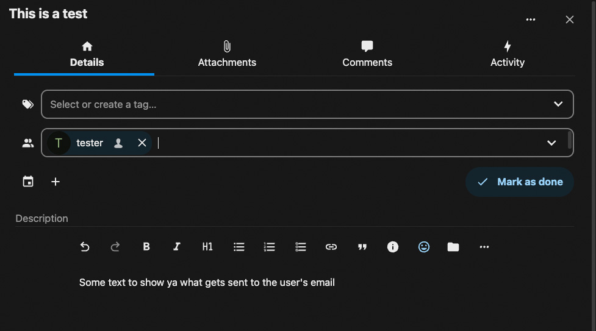
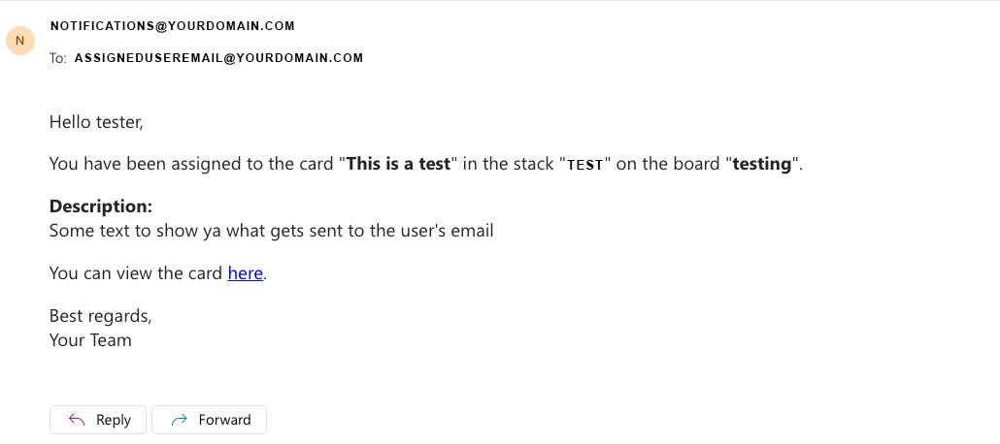

# Nextcloud Deck Assignment Notifications

A Python script that sends email notifications to users when they are assigned a new card in Nextcloud Deck.

## Prerequisites

- Python 3.x
- MySQL Server
- An SMTP server (e.g., Mailtrap for testing)

## Installation

1. **Clone the Repository**

   ```bash
   git clone https://github.com/yourusername/nextcloud-deck-assignment-notifications.git
   cd nextcloud-deck-assignment-notifications

2. **Setup a Virtual Environment**

   ```bash
   python3 -m venv venv
   source venv/bin/activate

3. **Install the Required Packages**

   ```bash
    pip install -r requirements.txt

4. **Create a .env File**
Copy the .env.example file to .env and fill in the required settings.

    ```bash
    cp .env.example .env
    ```

5. **set up a cron job (i used cpanel)**
    - Go to cron jobs in cpanel
    - Add a new cron job
    - Set the command to `python /path/to/main.py` (could also be `python3` depending on your system)
    - Set the frequency to every 5 minutes

    alternatively, you could use crontab on your server

    ```bash
    crontab -e
    ```

    then add the following line to the file

    ```bash
    */5 * * * * /path/to/python /path/to/main.py
    ```

6. **Run the setup script**

    ```bash
    python setup.py

7. **Run the script**

    ```bash
    python main.py
    ```

## Check it out:
assign a card to a user in nextcloud deck and wait for the email notification
<!-- media/assignment_example.jpg -->

Here's what the email looks like
<!-- media/email_example.jpg -->


Feel free to modify any element of this. I realize that not everyone uses mysql for instance(though, i believe it's fully compatible with mariadb?)
In a future version i might make a 'email_template' file that can be modified to change the email template instead of hardcoding it in the script. if you'd like to do that, please do.
I hope it's helpful to you!

## License
none! do whatever you want with it. I'd appreciate a mention if you use it in a project though.
